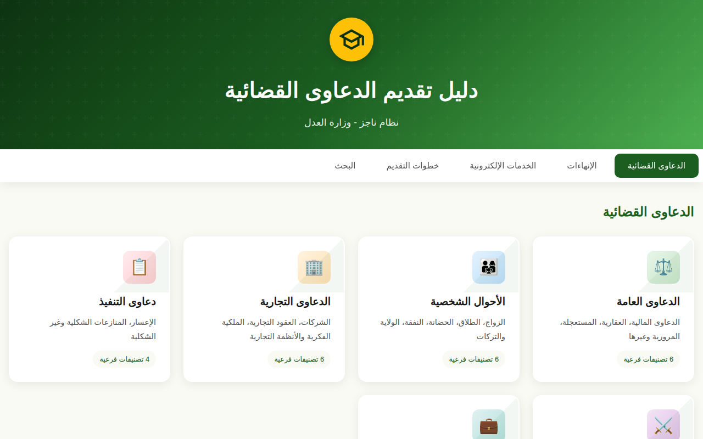
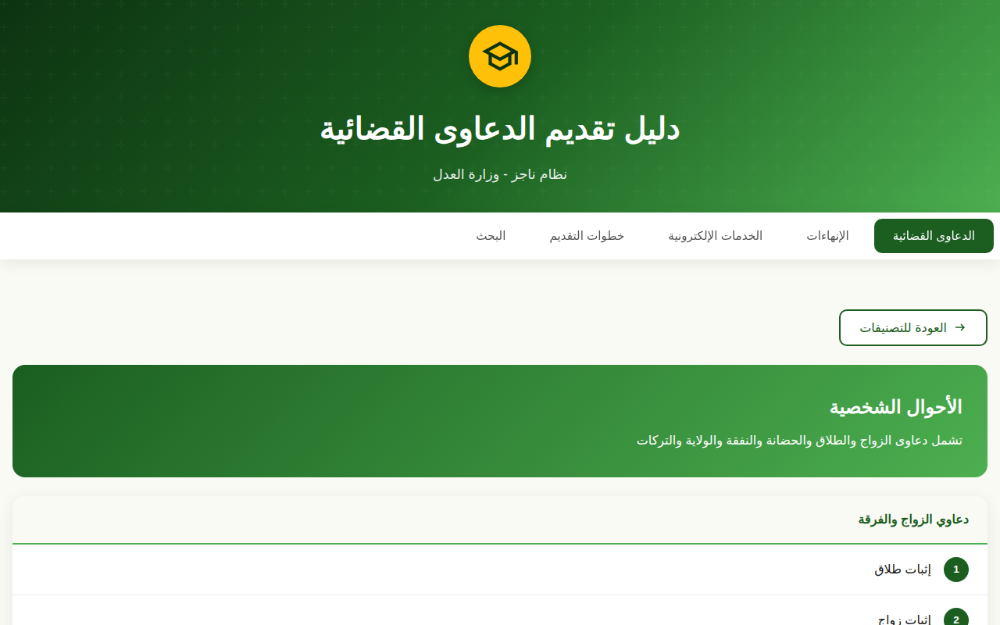
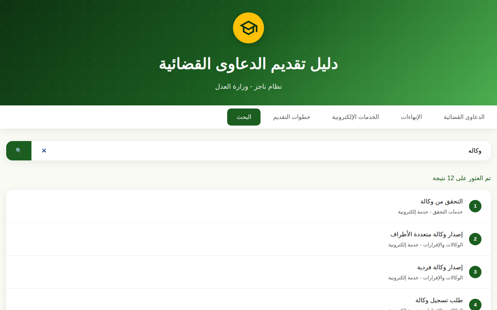

<div align="center">

# ⚖️ دليل تقديم الدعاوى القضائية

### نظام ناجز - وزارة العدل السعودية

دليل تفاعلي شامل يساعد المستخدمين على فهم آلية تقديم الدعاوى والإنهاءات القضائية عبر منصة ناجز

[](https://abosalehg-ui.github.io/Guide-to-Filing-Lawsuits/)
[](https://developer.mozilla.org/en-US/docs/Web/HTML)
[](https://developer.mozilla.org/en-US/docs/Web/CSS)
[](https://developer.mozilla.org/en-US/docs/Web/JavaScript)

[🌐 معاينة التطبيق](https://abosalehg-ui.github.io/Guide-to-Filing-Lawsuits/) · [📝 الإبلاغ عن مشكلة](https://github.com/abosalehg-ui/Guide-to-Filing-Lawsuits/issues)

</div>

---

## 📌 نظرة عامة

تطبيق ويب تفاعلي يُقدم دليلاً مرجعياً شاملاً للمواطنين والمقيمين في المملكة العربية السعودية، يشرح كيفية تقديم الدعاوى القضائية والإنهاءات والخدمات الإلكترونية المتاحة عبر **منصة ناجز** التابعة لوزارة العدل.
إعداد وتنظيم: **فيصل بن عائض بن سالم المزيني**


## ✨ المميزات

| الميزة | الوصف |
|--------|-------|
| 📱 **تصميم متجاوب** | يعمل بسلاسة على جميع الأجهزة (هواتف، أجهزة لوحية، حواسيب) |
| 🔍 **بحث فوري** | بحث في جميع البنود — الدعاوى والإنهاءات والخدمات الإلكترونية |
| 🔤 **بحث عربي متسامح** | يطابق الكتابة بدون همزات أو تشكيل: `احوال` تعطي نفس نتائج `أحوال` |
| 🎯 **تصنيف منظم** | تصنيف واضح ومنطقي لجميع أنواع الدعاوى |
| 🔗 **روابط مباشرة** | كل تصنيف له رابط قابل للمشاركة، وزر الرجوع في المتصفح يعمل |
| ⌨️ **تنقّل بلوحة المفاتيح** | كل العناصر قابلة للتشغيل بلوحة المفاتيح، مع مؤشّر تركيز مرئي |
| 🌙 **واجهة عربية** | دعم كامل للغة العربية واتجاه RTL |
| ⚡ **أداء سريع** | ملف واحد بلا أي مكتبات أو خطوة بناء |

## 📂 محتويات الدليل

### ⚖️ الدعاوى القضائية
- **الدعاوى العامة** - المالية، العقارية، المستعجلة، المرورية
- **الأحوال الشخصية** - الزواج، الطلاق، الحضانة، النفقة، الولاية
- **الدعاوى التجارية** - الشركات، العقود التجارية، الملكية الفكرية
- **دعاوى التنفيذ** - الإعسار، المنازعات الشكلية
- **الدعاوى الجزائية** - الحق الخاص، الحدود، القصاص
- **الدعاوى العمالية** - الحقوق الوظيفية، التعويضات

### 📜 الإنهاءات
- الورثة والتركات
- الولايات والأذونات
- الإثباتات الاجتماعية
- الأوقاف والوصايا
- تعديلات الصكوك

### 🖥️ الخدمات الإلكترونية
- الحالات الاجتماعية (توثيق الزواج، الطلاق)
- الرهون والعقارات
- خدمات التحقق
- التراخيص والوكالات
- كتابة العدل الافتراضية

## 🚀 التشغيل

### الطريقة الأولى: المعاينة المباشرة
قم بزيارة الرابط التالي مباشرة:
```
https://abosalehg-ui.github.io/Guide-to-Filing-Lawsuits/
```

### الطريقة الثانية: التشغيل المحلي
```bash
# استنساخ المستودع
git clone https://github.com/abosalehg-ui/Guide-to-Filing-Lawsuits.git

# الانتقال للمجلد
cd Guide-to-Filing-Lawsuits

# فتح الملف في المتصفح
open index.html
# أو
start index.html  # على Windows
```

## 🛠️ التقنيات المستخدمة

- **HTML5** - هيكلة المحتوى
- **CSS3** - التصميم والتنسيق
- **JavaScript** - التفاعلية والبحث
- **GitHub Pages** - الاستضافة

بلا أي إطار أو مكتبة أو خطوة بناء. الاعتماد الخارجي الوحيد هو خطا Tajawal و Cairo
من Google Fonts، ويعمل التطبيق بدونهما بالاعتماد على خطوط النظام.

## 🗂️ بنية المستودع

```
index.html                     التطبيق كاملاً: البيانات والأنماط والسكربت
tests/guide.test.mjs           اختبارات البيانات والترميز (بلا اعتماديات)
.github/workflows/ci.yml       تشغيل الاختبارات على كل دفعة
docs/screenshots/              لقطات الشاشة المستخدمة في هذا الملف
LICENSE                        رخصة MIT للكود
```

البيانات الثلاث داخل `index.html` هي `lawsuitCategories` و `completionData`
و `serviceData`. الأعداد المعروضة في البطاقات تُشتق من هذه البيانات عند التحميل
عبر سمات `data-count-for*`، فلا يمكن أن تنفصل عنها.

## 📸 لقطات الشاشة

<div align="center">

**الصفحة الرئيسية — التصنيفات الرئيسية للدعاوى**



**قائمة أنواع الدعاوى داخل تصنيف**



**البحث — نتائج استعلام مكتوب بدون همزة**



</div>

## ⌨️ الاختصارات والروابط المباشرة

| الاختصار | الوظيفة |
|---|---|
| `/` | الانتقال إلى البحث وتركيز حقل الإدخال |
| `Esc` | إغلاق النافذة المنبثقة |
| `Tab` / `Enter` | التنقّل بين العناصر وتشغيلها |

حالة التطبيق محفوظة في عنوان الصفحة، فيمكن مشاركة رابط مباشر لأي قسم أو تصنيف:

```
index.html#/services              الخدمات الإلكترونية
index.html#/lawsuits/labor        الدعاوى العمالية
index.html#/steps                 خطوات التقديم
```

## 🧪 الاختبارات

الاختبارات تعتمد على وحدات Node المدمجة فقط (`node:test`, `node:assert`, `node:vm`)،
فلا حاجة لتثبيت أي شيء:

```bash
node --test tests/*.mjs
```

تتحقق من أن الأعداد المعروضة مشتقّة من البيانات لا مكتوبة يدوياً، وأن فهرس البحث
يغطي مجموعات البيانات الثلاث، وأن التطبيع العربي يعمل، وأن ثوابت إمكانية الوصول
(مؤشّر التركيز، دلالات النافذة، تسمية حقل البحث) لم تسقط. تعمل تلقائياً على كل
دفعة عبر GitHub Actions.

## 🤝 المساهمة

المساهمات مرحب بها! إذا كانت لديك اقتراحات أو تحسينات:

1. قم بعمل Fork للمستودع
2. أنشئ فرعاً جديداً (`git checkout -b feature/تحسين-جديد`)
3. قم بتنفيذ التغييرات (`git commit -m 'إضافة ميزة جديدة'`)
4. ارفع التغييرات (`git push origin feature/تحسين-جديد`)
5. افتح Pull Request

## 📄 الترخيص

الكود مرخّص تحت [رخصة MIT](LICENSE).

أما المحتوى القانوني — أسماء الدعاوى والإنهاءات والخدمات وتصنيفاتها — فمستمد من
المعلومات المنشورة لمنصة ناجز ووزارة العدل السعودية، وحقوقه تعود لأصحابها.

## ⚠️ إخلاء مسؤولية

هذا **دليل استرشادي غير رسمي**، وغير تابع لوزارة العدل أو منصة ناجز، ولا يُغني عن
الاستشارة القانونية. المحتوى قد يتغيّر بتغيّر الأنظمة والخدمات، والمصدر المعتمد دائماً
هو [منصة ناجز الرسمية](https://www.najiz.sa/).

**آخر مطابقة للمحتوى:** 2026-08-03

## 👥 فريق العمل

<div align="center">

| الدور | الاسم |
|---|---|
| إعداد وتنظيم المحتوى | **فيصل بن عائض بن سالم المزيني** |
| تطوير التطبيق | **عبدالكريم العبود** |

[](mailto:abo.saleh.g@gmail.com)
[](https://github.com/abosalehg-ui)

</div>

## 🔗 روابط مفيدة

- [منصة ناجز الرسمية](https://www.najiz.sa/)
- [وزارة العدل السعودية](https://www.moj.gov.sa/)

---

<div align="center">


صُنع بـ ❤️ لخدمة المجتمع السعودي

</div>
