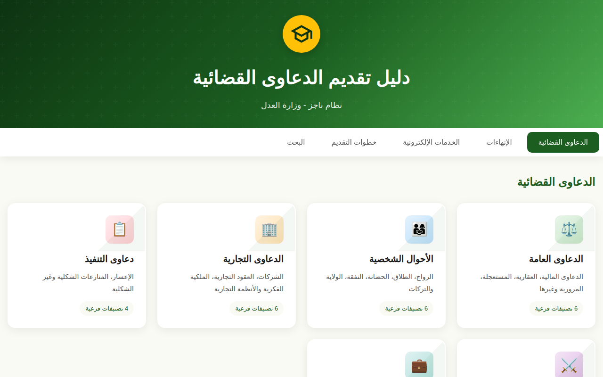
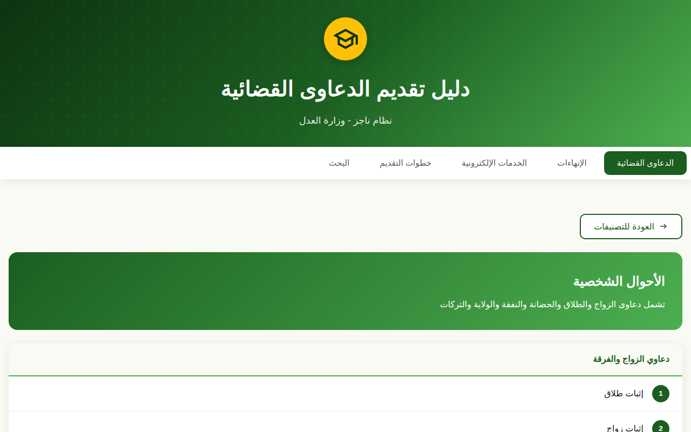
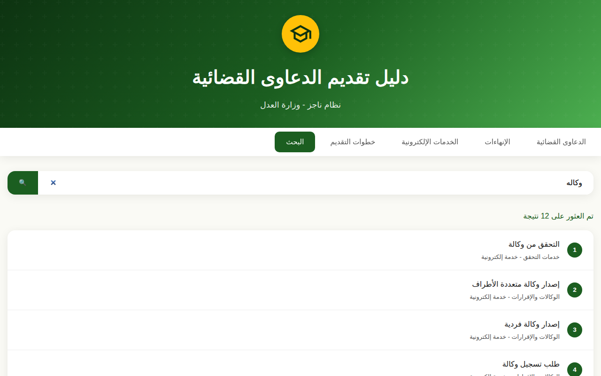

<div align="center">

# ⚖️ دليل تقديم الدعاوى القضائية

### نظام ناجز - وزارة العدل السعودية

دليل تفاعلي شامل يساعد المستخدمين على فهم آلية تقديم الدعاوى والإنهاءات القضائية عبر منصة ناجز

[](https://abosalehg-ui.github.io/Guide-to-Filing-Lawsuits/)
[](https://developer.mozilla.org/en-US/docs/Web/HTML)
[](https://developer.mozilla.org/en-US/docs/Web/CSS)
[](https://developer.mozilla.org/en-US/docs/Web/JavaScript)

[🌐 معاينة التطبيق](https://abosalehg-ui.github.io/Guide-to-Filing-Lawsuits/) · [📝 الإبلاغ عن مشكلة](https://github.com/abosalehg-ui/Guide-to-Filing-Lawsuits/issues)

</div>

---

## 📌 نظرة عامة

تطبيق ويب تفاعلي يُقدم دليلاً مرجعياً شاملاً للمواطنين والمقيمين في المملكة العربية السعودية، يشرح كيفية تقديم الدعاوى القضائية والإنهاءات والخدمات الإلكترونية المتاحة عبر **منصة ناجز** التابعة لوزارة العدل.
إعداد وتنظيم: **فيصل بن عائض بن سالم المزيني**


## ✨ المميزات

| الميزة | الوصف |
|--------|-------|
| 📱 **تصميم متجاوب** | يعمل بسلاسة على جميع الأجهزة (هواتف، أجهزة لوحية، حواسيب) |
| 🔍 **بحث فوري** | بحث في جميع البنود — الدعاوى والإنهاءات والخدمات الإلكترونية، ويُحفظ الاستعلام في الرابط |
| 🔤 **بحث عربي متسامح** | يطابق الكتابة بدون همزات أو تشكيل: `احوال` تعطي نفس نتائج `أحوال` |
| 🎯 **تصنيف منظم** | تصنيف واضح ومنطقي لجميع أنواع الدعاوى |
| 🔗 **روابط مباشرة** | كل تصنيف له رابط قابل للمشاركة، وزر الرجوع في المتصفح يعمل |
| ⌨️ **تنقّل بلوحة المفاتيح** | كل العناصر قابلة للتشغيل بلوحة المفاتيح، والتركيز ينتقل مع المحتوى عند التنقّل |
| 🏛️ **المحكمة المختصة** | تظهر لعدد من الدعاوى الشائعة مع رابط المصدر الرسمي |
| 🖨️ **طباعة كاملة** | الطباعة تُخرج كل البنود، لا القسم المفتوح فقط |
| 🌙 **واجهة عربية** | دعم كامل للغة العربية واتجاه RTL |
| ⚡ **أداء سريع** | ملف واحد بلا أي مكتبات أو خطوة بناء |

## 📂 محتويات الدليل

### ⚖️ الدعاوى القضائية
- **الدعاوى العامة** - المالية، العقارية، المستعجلة، المرورية
- **الأحوال الشخصية** - الزواج، الطلاق، الحضانة، النفقة، الولاية
- **الدعاوى التجارية** - الشركات، العقود التجارية، الملكية الفكرية
- **دعاوى التنفيذ** - الإعسار، المنازعات الشكلية
- **الدعاوى الجزائية** - الحق الخاص، الحدود، القصاص
- **الدعاوى العمالية** - الحقوق الوظيفية، التعويضات

### 📜 الإنهاءات
- الورثة والتركات
- الولايات والأذونات
- الإثباتات الاجتماعية
- الأوقاف والوصايا
- تعديلات الصكوك

### 🖥️ الخدمات الإلكترونية
- الحالات الاجتماعية (توثيق الزواج، الطلاق)
- الرهون والعقارات
- خدمات التحقق
- التراخيص والوكالات
- كتابة العدل الافتراضية

## 🚀 التشغيل

### الطريقة الأولى: المعاينة المباشرة
قم بزيارة الرابط التالي مباشرة:
```
https://abosalehg-ui.github.io/Guide-to-Filing-Lawsuits/
```

### الطريقة الثانية: التشغيل المحلي
```bash
# استنساخ المستودع
git clone https://github.com/abosalehg-ui/Guide-to-Filing-Lawsuits.git

# الانتقال للمجلد
cd Guide-to-Filing-Lawsuits

# فتح الملف في المتصفح
open index.html
# أو
start index.html  # على Windows
```

## 🛠️ التقنيات المستخدمة

- **HTML5** - هيكلة المحتوى
- **CSS3** - التصميم والتنسيق
- **JavaScript** - التفاعلية والبحث
- **GitHub Pages** - الاستضافة

بلا أي إطار أو مكتبة أو خطوة بناء. الاعتماد الخارجي الوحيد هو خطا Tajawal و Cairo
من Google Fonts، ويعمل التطبيق بدونهما بالاعتماد على خطوط النظام.

لا يوجد سكربت مضمَّن في الصفحة، فسياسة أمن المحتوى (CSP) تمنع أي سكربت لا يأتي من
ملفات الموقع نفسه (`script-src 'self'`).

## 🗂️ بنية المستودع

```
index.html                     الهيكل والأنماط
data.js                        المحتوى: الدعاوى والإنهاءات والخدمات وتفاصيل الدعاوى
app.js                         السلوك: البطاقات والبحث والتوجيه والنافذة المنبثقة والطباعة
tests/guide.test.mjs           اختبارات البيانات والترميز (بلا اعتماديات)
tests/e2e/app.e2e.test.mjs     اختبارات المتصفح (Playwright)
.github/workflows/ci.yml       تشغيل الاختبارات على كل دفعة
docs/screenshots/              لقطات الشاشة المستخدمة في هذا الملف
docs/reviews/                  تقارير مراجعة الكود
LICENSE                        رخصة MIT للكود
```

## ✍️ تعديل المحتوى

كل المحتوى في `data.js` وحده، ولا يتكرر في `index.html`: البطاقات والأعداد وفهرس
البحث كلها تُبنى منه عند التحميل.

- **إضافة دعوى أو خدمة:** أضف اسمها إلى المصفوفة المناسبة.
- **إضافة تصنيف أو مجموعة:** أضف كائناً فيه `title` و `icon` و `color` و `summary`
  (والألوان المتاحة: `blue`, `green`, `orange`, `purple`, `red`, `teal`).
- **تفاصيل دعوى بعينها:** أضفها في `caseDetails` باسم الدعوى نفسه، مع مصدر رسمي في
  `sources` إلزامياً. لا تُضاف معلومة بلا مصدر.

بعد أي تعديل شغّل `npm test`: إن كان في `data.js` فاصلة أو علامة تنصيص ناقصة، يفشل
أول اختبار ويذكر موضع الخطأ.

## 📸 لقطات الشاشة

<div align="center">

**الصفحة الرئيسية — التصنيفات الرئيسية للدعاوى**



**قائمة أنواع الدعاوى داخل تصنيف**



**البحث — نتائج استعلام مكتوب بدون همزة**



</div>

## ⌨️ الاختصارات والروابط المباشرة

| الاختصار | الوظيفة |
|---|---|
| `/` | الانتقال إلى البحث وتركيز حقل الإدخال (يعمل أيضاً على لوحة المفاتيح العربية: زر «ظ») |
| `Esc` | إغلاق النافذة المنبثقة |
| `Tab` / `Enter` | التنقّل بين العناصر وتشغيلها |

حالة التطبيق محفوظة في عنوان الصفحة، فيمكن مشاركة رابط مباشر لأي قسم أو تصنيف:

```
index.html#/services              الخدمات الإلكترونية
index.html#/lawsuits/labor        الدعاوى العمالية
index.html#/steps                 خطوات التقديم
index.html#/search/وكالة          نتائج البحث عن «وكالة»
```

## 🧪 الاختبارات

**اختبارات البيانات والترميز** تعتمد على وحدات Node المدمجة فقط، فلا حاجة لتثبيت شيء:

```bash
npm test          # أو: node --test tests/*.mjs
```

تشغّل `data.js` والجزء الخالص من `app.js` نفسه في بيئة معزولة، وتتحقق من: سلامة
البيانات وعدم تكرارها، أن فهرس البحث الفعلي يحوي كل البنود، التطبيع العربي، أن كل
تفصيل دعوى له مصدر رسمي، تباين الألوان، وغياب السكربت المضمَّن و `innerHTML`.

**اختبارات المتصفح** تفتح الصفحة في Chromium وتجرّب السلوك الفعلي: الروابط المباشرة
والمشوّهة، انتقال التركيز، النافذة المنبثقة وزر الرجوع، البحث وحدّه الأعلى، اختصار
لوحة المفاتيح العربية، والطباعة:

```bash
npm ci
npx playwright install chromium
npm run test:e2e
```

Playwright اعتماد للاختبارات فقط؛ التطبيق نفسه بلا أي اعتماديات. النوعان يعملان
تلقائياً على كل دفعة عبر GitHub Actions.

## 🤝 المساهمة

المساهمات مرحب بها! إذا كانت لديك اقتراحات أو تحسينات:

1. قم بعمل Fork للمستودع
2. أنشئ فرعاً جديداً (`git checkout -b feature/تحسين-جديد`)
3. قم بتنفيذ التغييرات (`git commit -m 'إضافة ميزة جديدة'`)
4. ارفع التغييرات (`git push origin feature/تحسين-جديد`)
5. افتح Pull Request

## 📄 الترخيص

الكود مرخّص تحت [رخصة MIT](LICENSE).

أما المحتوى القانوني — أسماء الدعاوى والإنهاءات والخدمات وتصنيفاتها — فمستمد من
المعلومات المنشورة لمنصة ناجز ووزارة العدل السعودية، وحقوقه تعود لأصحابها.

## ⚠️ إخلاء مسؤولية

هذا **دليل استرشادي غير رسمي**، وغير تابع لوزارة العدل أو منصة ناجز، ولا يُغني عن
الاستشارة القانونية. المحتوى قد يتغيّر بتغيّر الأنظمة والخدمات، والمصدر المعتمد دائماً
هو [منصة ناجز الرسمية](https://www.najiz.sa/).

**آخر مطابقة للمحتوى:** 2026-08-03

## 👥 فريق العمل

<div align="center">

| الدور | الاسم |
|---|---|
| إعداد وتنظيم المحتوى | **فيصل بن عائض بن سالم المزيني** |
| تطوير التطبيق | **عبدالكريم العبود** |

[](mailto:abo.saleh.g@gmail.com)
[](https://github.com/abosalehg-ui)

</div>

## 🔗 روابط مفيدة

- [منصة ناجز الرسمية](https://www.najiz.sa/)
- [وزارة العدل السعودية](https://www.moj.gov.sa/)

---

<div align="center">


صُنع بـ ❤️ لخدمة المجتمع السعودي

</div>
